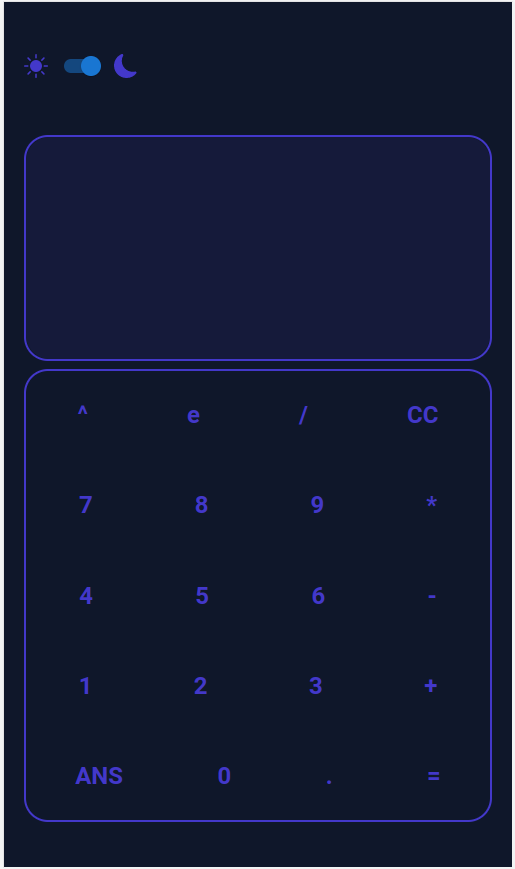
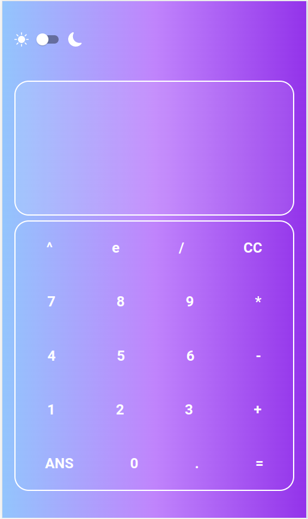
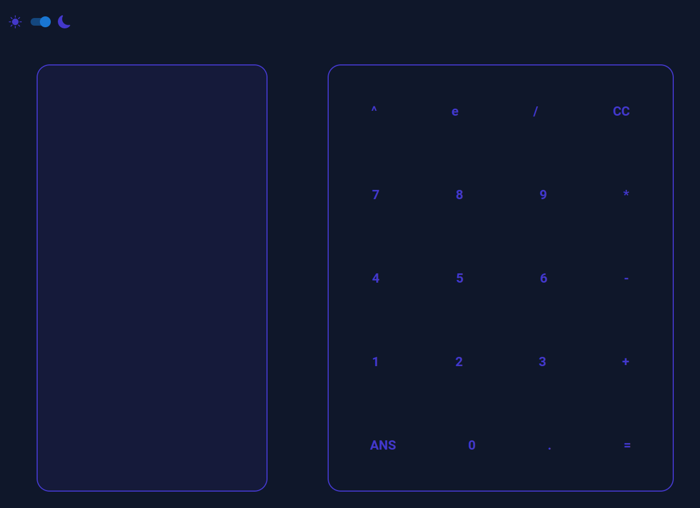
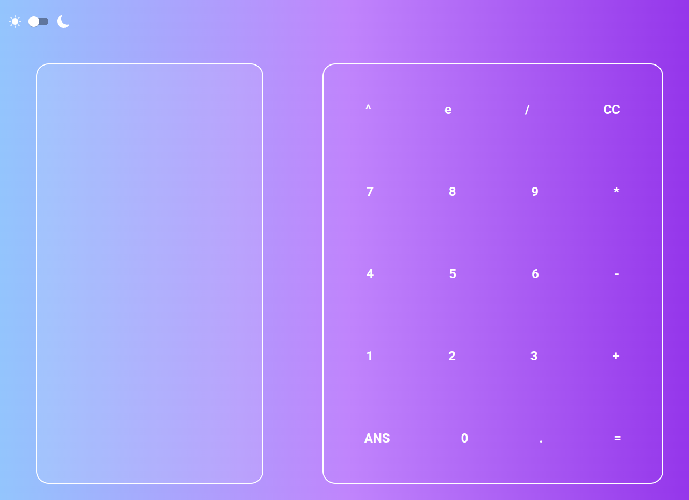

# Calculator 

Responsive calculator with dark mode. <a href="https://calculator-cyan-kappa.vercel.app/">Click to access</a>





## Technologies
     

## How to run

1. Clone this repository
2. Install dependencies

```bash
npm i
```

3. Run the project

```bash
npm run dev
```
